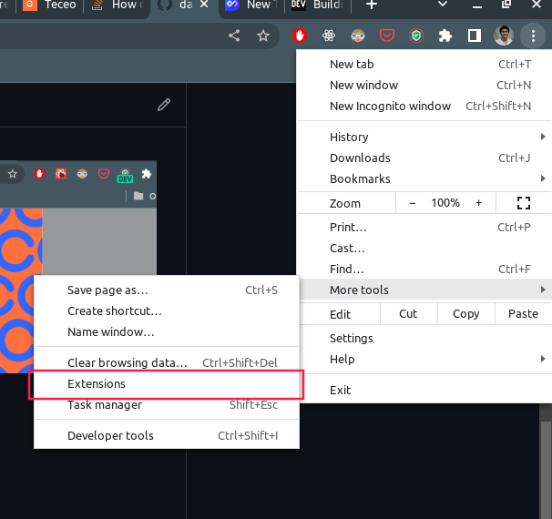
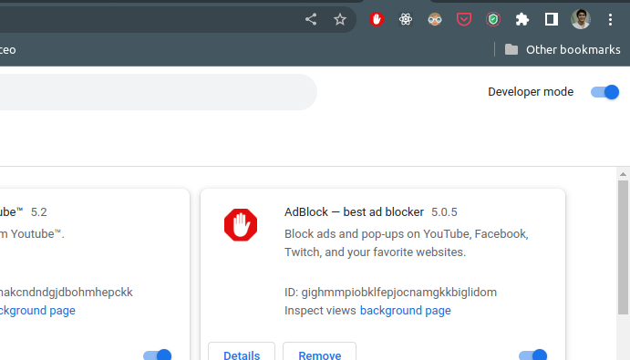
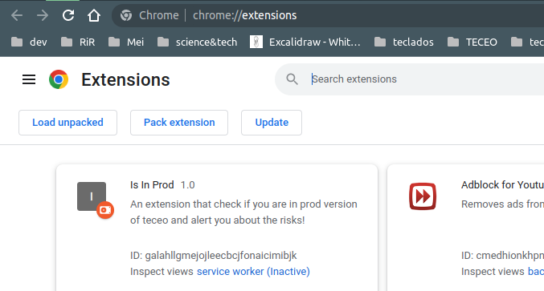

# App Enviroment Info

checks which enviroment you are based on tab url: `DEV`, `PROD` or `HML`

## How it works?

the extension have two constants: `PROD_URL` and `HOMOLOG_URL` that represents the respectives urls of your app enviroments for production and staging.

## Installation guide

- clone this repo

- open Chrome Extensions: Settings > More Tools > Extensions

- Toggle the developer mode

- click in `Load unpacked`

- select the path on your cloned the repo and the extension will be appear like the image above

## Main functionalities

### 1. env info on extension icon

the first functionality shows which env you are in extension icon

### 2. env info on page

the second functionality shows which env you are in page on top of your app content

### 3. personalize if you want show info on your app page

